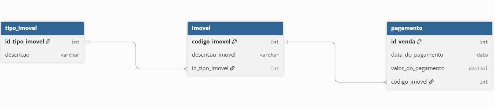

# 🏢 API - Sistema Imobiliário (HOW VII)
API REST desenvolvida em Node.js e MySQL para gestão e consultas de dados imobiliários, documentada via Swagger/OpenAPI.  
Projeto integrador para a disciplina de Hands On Work VII do curso de Análise e Desenvolvimento de Sistemas.

## 🛠️ Tecnologias Utilizadas
**Runtime**: Node.js  
**Framework Web**: Express  
**Banco de Dados**: MySQL (mysql2)  
**Documentação**: Swagger UI (swagger-ui-express + yamljs)

## 🗄️ Banco de Dados
O banco de dados (gestao_imobiliaria) foi planejado e estruturado pela equipe para relacionar imóveis, seus respectivos tipos e os históricos de pagamentos efetuados.  

## 🔌 Endpoints
📍 Rotas Disponíveis

*GET /api-how-vii*  
Interface interativa da documentação Swagger (OpenAPI lido do arquivo how-vii.yaml).

*GET /pagamentos*  
Retorna a lista detalhada de pagamentos contendo ID da venda, data, valor, código do imóvel, descrição do imóvel e tipo do imóvel.
Retorno: JSON

*GET /pagamentos_por_imovel*  
**Gráfico A:** Retorna a somatória de todos os pagamentos para determinado imóvel, organizado por ID do imóvel.

*GET /pagamentos_por_mes_ano*  
**Gráfico B:** Retorna o total de vendas para cada mês e ano.

*GET /porcentagem_por_tipo_imovel*  
**Gráfico C:** Retorna o percentual de vendas por tipo de imóvel.

## 💻 Como Rodar
*Bash*  
**Clone o projeto**  
git clone https://github.com/seu-usuario/seu-repositorio.git
cd seu-repositorio

**Instale as dependências**
- npm install express
- npm install mysql2
- npm install express swagger-ui-express yamljs
- npm install cors

**Certifique-se de que o MySQL está rodando na porta 33100 com a base gestao_imobiliaria.**

**Acesse no navegador**
- Servidor: http://localhost:4040
- Swagger Docs: http://localhost:4040/api-how-vii
- Rota de Pagamentos: `
